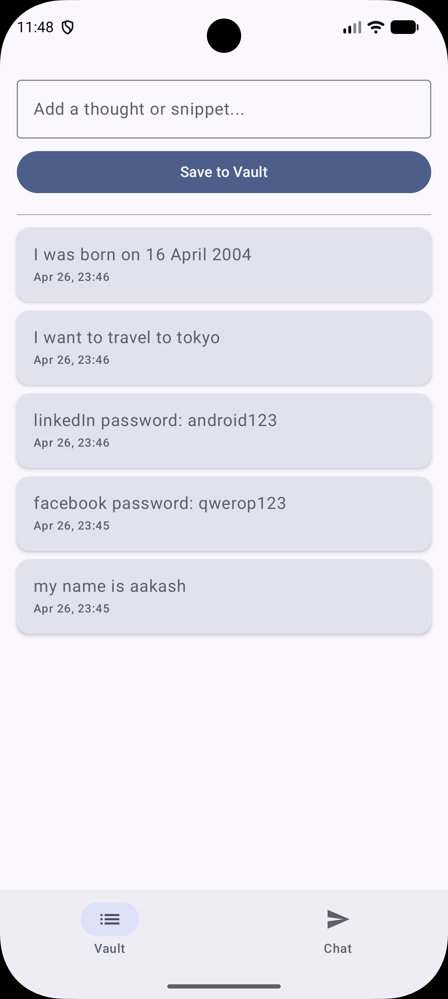
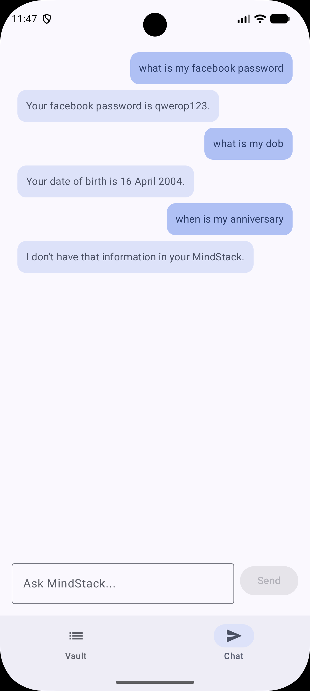

# MindStackAI 🧠

An intelligent personal knowledge vault that allows users to interactively chat with their locally stored data securely and privately.

---

## 🚀 Features

* **Local Knowledge Vault:** Seamlessly interact and chat with your data completely offline.
* **On-Device RAG Pipeline:** Securely generates and stores vector embeddings locally, ensuring absolute data privacy.
* **Semantic Search:** Uses a custom-built Cosine Similarity algorithm for fast, accurate context retrieval.
* **Token & Latency Optimized:** Minimizes Gemini API token consumption and reduces latency by feeding only the most relevant context to the LLM.

---

## 📱 Screenshots

<table width="100%">
  <tr>
    <td width="33%" align="center">
      
       <b>Knowledge Vault Home</b>
    </td>
    <td width="33%" align="center">
      
       <b>AI Chat w/ Local Context</b>
    </td>
  </tr>
</table>

---

## 🛠️ Tech Stack

This project is built using modern Android development practices and cutting-edge Generative AI tools:

* **Language:** Kotlin
* **UI Framework:** Jetpack Compose
* **Database:** RoomDB (Utilized for local structured data and custom vector embedding storage)
* **Architecture:** MVVM (Model-View-ViewModel) with Clean Architecture principles
* **Dependency Injection:** Dagger Hilt
* **Asynchronous Programming:** Kotlin Coroutines & Flow
* **AI Integration:** Google Generative AI SDK (Gemini API)

---

## 📐 Architecture & Core Concepts

### Mobile Retrieval-Augmented Generation (RAG)

Instead of sending entire large documents to the cloud, **MindStackAI** breaks down your local data, processes it into vector embeddings, and stores it directly on the device using **RoomDB**.

When you ask a question:

1. A **Cosine Similarity** search algorithm runs locally against your Room database.
2. It extracts only the most semantically relevant text chunks.
3. This precise context is bundled with your prompt and sent to the Gemini API, keeping token usage low and responses lightning-fast.

---

## 👨‍💻 Author

* **Aakash Dwivedy** - [@dwivedyaakash](https://github.com/dwivedyaakash)
